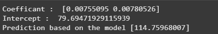

# Implementation of Multivariate Linear Regression
## Aim
To write a python program to implement multivariate linear regression and predict the output.
## Equipment’s required:
1.	Hardware – PCs
2.	Anaconda – Python 3.7 Installation / Moodle-Code Runner
## Algorithm:
### Step1
Import pandas as pd.
<br>

### Step2
Read the csv file.
<br>

### Step3
Get the value of X and y variables
<br>

### Step4
Create the linear regression model and fit.
<br>

### Step5
Predict the CO2 emission of a car where the weight is 3300kg, and the volume is 1300cm cube.
<br>

## Program:
``` python
#NAME : SANTHOSE AROCKIARAJ J
#REGNO : 212224230248

import pandas as pd
from sklearn import linear_model
df=pd.read_csv("car.csv")
x=df[["Weight","Volume"]]
y=df["CO2"]
model=linear_model.LinearRegression()
model.fit(x,y)
print("Coefficant : ",model.coef_)
print("Intercept : ",model.intercept_)
print("Prediction based on the model",model.predict([[3300,1300]]))

```
## Output:


<br>

## Result
Thus the multivariate linear regression is implemented and predicted the output using python program.
